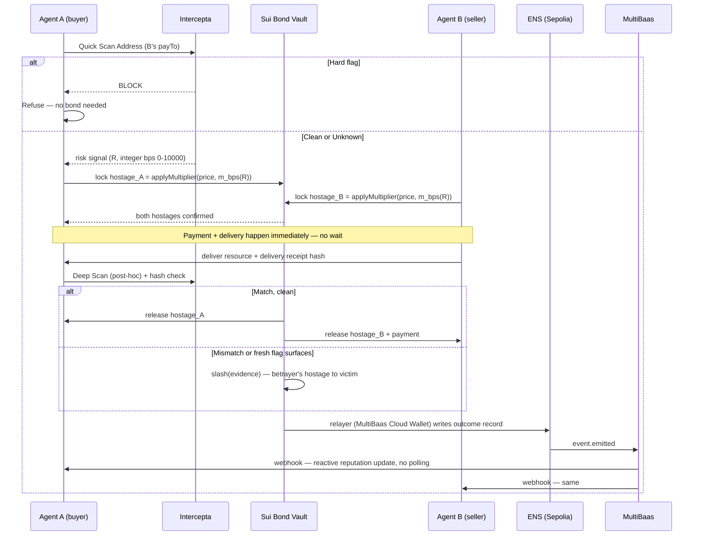

# Bonded — Hostage Protocol (Aligned Final)
### Automated customs bonds for agent-to-agent commerce

**Event:** ETHGlobal Tokyo 2026
**Sponsors targeted:** Intercepta ($2,000/$500 cont.) · Sui ($5,000) · World — ID for Agents ($5,000/$5,000 cont.) · ENSv2 ($6,000/$4,000 cont.) · Curvegrid — Best AI Agent Project ($1,000) + Best Digital Asset Dashboard ($1,000, zero-extra-build bonus)
**Sponsors deliberately not targeted:** 1inch, Uniswap Foundation (no swap in this story); Curvegrid's RWA Tokenization track (no real-world asset here)
**Lineage:** third generation of the Bonded PRD series — `BONDED_PRD.md` (ETHOnline, The Graph/Arc/Ledger) → `BONDED_IMPLEMENTATION_PRD.md` (same event, build-ready) → `BONDED_COMMERCE_MIGRATION_PRD.md` (first Tokyo migration, Intercepta/World/Sui, re-derivation mechanism) → **this document** (Tokyo, hostage-settlement mechanism, ENS + Curvegrid added). The mechanism has changed twice now; the discipline that surrounds it — the `[VERIFY]` rule, the fixed-point rule, the honest-disclosure rule — has not, and this revision restores three pieces of that discipline that had quietly gone missing.

Where a detail depends on a live SDK/API surface not independently verified, it's marked **[VERIFY]**. Do not guess a plausible-looking signature for a `[VERIFY]` item — this line is carried verbatim from every prior document in the series because it is the single rule most often broken under deadline pressure.

---

## Part A — The idea, in one page

**The failure every screening project this weekend will hit and quietly ignore.** Intercepta's API returns three kinds of verdict: bad (sanctioned, scam-linked, drainer-approved), good (clean history), and *unknown* — an address it has never seen before. Every "gate" project — check, then allow or block — has no good answer for unknown. Block it, and you've killed commerce with every new agent that has no track record yet, which is most agents on day one of an agent economy. Allow it, and you've built a screener that only works on people already caught once.

**The mechanism that actually solves this, not around it.** This is not a new invention — it's a real, centuries-old trade practice, automated. A customs bond is how goods have always moved before duties are verified: the importer posts a bond larger than the goods' value, the goods release instantly, and the bond — not an inspector — is what makes cheating irrational. Apply that literally to agent-to-agent payment: **before either agent commits, both post a stake larger than the value of what's changing hands.** Delivery and payment can happen immediately — no escrow wait, no manual review — because the arithmetic of betrayal is negative. A scammer has to risk $60 to steal $50. Rational agents don't take a losing bet.

**Where Intercepta fits precisely.** Not as the gate — as the *evidence oracle*. A hard flag still refuses instantly, no bond needed. Where Intercepta becomes load-bearing is the unknown case: it doesn't say yes or no anymore, it says *how much collateral this risk level requires* — and, after the fact, it's the live re-scan that supplies the proof when a slash is triggered.

**Where Curvegrid fits precisely.** ENSv2 lives on Sepolia — an EVM chain MultiBaas already supports natively (confirmed against their current docs, not assumed). MultiBaas is the event layer between the on-chain bond outcome and everything that reacts to it: a webhook fires the instant a settlement or scar is written to an agent's ENS record, driving the live UI feed and the counterparties' own reputation checks, with zero polling anywhere in the system. The relayer authorized to write those records signs through a MultiBaas Cloud Wallet, not a hot key in an env file.

**The one-sentence pitch:** *Two AI agents that have never met transact instantly and safely — not because a filter caught the risk, but because the bond made lying a losing bet.*

**Why "Bonded" is still the right name.** "Licensed and bonded" is the actual term for a merchant you can trust with money before delivery. This isn't a metaphor borrowed for flavor — it's a customs bond, mechanically, automated for agents instead of shipping containers. (This is the same naming rationale as the prior Tokyo migration document, carried forward unchanged — it got sharper, not different, when the mechanism became a literal bond instead of a re-verification-only design.)

---

## Part B — Why this beats every gate and every pure-market idea

| Approach | What it does with "unknown" | Demo beat | Weakness a judge finds in 30 seconds |
|---|---|---|---|
| Simple gate (block/allow) | Refuses or blindly trusts | "Watch it get blocked" | Kills commerce with every new counterparty |
| Reputation market (bet on trust) | Prices it via a market | "Watch the price crash" | Needs liquidity/time to converge; if the market price doesn't actually gate the payment, it's decoration around a plain gate |
| **Hostage settlement (this project)** | Prices the *risk* into a collateral requirement that makes betrayal irrational regardless of history | "Watch two strangers transact in 5 seconds — then watch a cheat get slashed on-chain, on camera" | Requires a real capital lockup — solved by a short lock window and a one-round-trip demo |

Whiteboard proof, thirty seconds: **stake > payment value ⇒ expected value of cheating is negative ⇒ a rational agent doesn't cheat.**

---

## Part C — The mechanism, precisely

### C.1 Actors

- **Agent A (buyer)** — autonomous, paying over x402 for a resource.
- **Agent B (seller)** — autonomous, offering the resource behind an x402 paywall.
- **Bond Vault** — a Sui object holding both hostages for the duration of one transaction.
- **Oracle** — Intercepta, called live pre-commit (risk pricing) and post-delivery (slash evidence).
- **Identity Layer** — World ID for Agents.
- **Name Layer** — ENSv2 on Sepolia.
- **Event Layer** — MultiBaas, watching the ENS registry/resolver contracts and pushing real-time webhooks on any record change.

### C.2 The flow



### C.3 Dynamic stake sizing — integer basis points, not floats

**This is the one correctness fix carried over from the older PRDs in this revision.** Every prior Bonded document states, once, in a shared `money.ts`, that on-chain amounts are BigInt basis points, never a JavaScript `number`. The previous Hostage Protocol draft wrote the stake formula as `1.05 + 1.5 × R`, a float — a real regression against that rule, not a stylistic nit, since a float-derived stake feeding a Move `Balance<T>` amount is exactly the class of rounding bug the original discipline exists to prevent. Restated correctly:

```
R_bps      = risk_score_bps(Intercepta response)   // 0 .. 10000, integer, never a float
R_unknown  = 6000                                    // fixed, disclosed value for "no data yet"
m_bps(R)   = 10500 + (15000 * R_bps) / 10000        // floor 10500 (1.05x) so betrayal is
                                                      // never rational even at R=0
                                                      // cap 30000 (3.0x) — clamp explicitly
hostage    = applyMultiplier(transaction_value, m_bps(R))   // packages/seam/src/money.ts
```

`applyMultiplier` is defined once, in `packages/seam` (Part F.1), and imported everywhere a stake is computed — the same "one kernel, called from everywhere, unit-tested exhaustively" discipline the original enforcer's tolerance check used for premise comparisons.

### C.4 What triggers a slash

1. **Payment-side betrayal** — a fresh Intercepta Deep Scan at settlement surfaces a flag not visible at quote time. Evidence = the scan response, timestamped and stored.
2. **Delivery-side betrayal** — the delivered resource's hash doesn't match the seller's pre-payment commitment. Evidence = the mismatch, independently re-checkable.

Only these two conditions trigger a slash — disclosed as a deliberate scope limit (Part J), not hidden.

### C.5 Failure modes, addressed rather than ignored

- **Collusion:** collateral only ever returns to its own poster on a clean settlement — nothing to gain by faking one together.
- **False-flag griefing:** both slash paths require externally checkable evidence attached to the call; a false claim fails the check and the false accuser's own hostage stays at risk — the deterrent is symmetric.
- **The oracle is wrong:** out of scope for a weekend build, stated plainly (Part J) rather than hand-waved — the same "we do not defend against X" honesty pattern as the original PRD's §3.2.

---

## Part D — UX as the architecture, not a layer on top of it

The core design decision: **the safety mechanism has no button.** Per-transaction human approval is the failure mode this project argues against, not a feature. The primary experience is two AI agents transacting with nobody watching in real time; the UI's job is to make that invisible safety legible after the fact.

### D.1 Visual language — "The Wharf"

- **Palette:** base `#0E1210` · panel `#171D1A` · hairline `#232B27` · manifest ink `#D8D2C2` · bond green `#3FA37A` (released) · hold amber `#D9A441` (unknown, priced) · seized red `#C2452C` (slashed).
- **Type:** a serif/slab heading face (customs-ledger feel, e.g. IBM Plex Serif) + JetBrains Mono `tabular-nums` for every amount, timestamp, address — numbers never move in a proportional font.
- **Motion budget — three animations, no more:** a stamp-press marking RELEASED/SEIZED; a manifest line sliding in per webhook event; a scar mark appearing on an agent's profile the instant its record updates.

### D.2 The three screens that exist

1. **The Wharf** — live manifest, driven entirely by MultiBaas webhooks, no polling. Doubles, honestly, as Curvegrid's Digital Asset Dashboard entry.
2. **Agent Manifest** (`agentname.agents.eth`) — resolves ENS text records: verified-since date, clean settlement count, scar records with evidence hashes.
3. **Recovery Desk** — the one human-facing button; a scarred agent is locked from new bonds until its owner completes a fresh World ID verification.

### D.3 The demo's woah moment, choreographed

Watch two agents that have never interacted settle a real transaction in under five seconds, zero human input — then watch a scripted cheat get its stake seized live, on the Sui explorer, with the Wharf's manifest line stamping SEIZED in real time because a webhook just told it to, not because someone refreshed a page.

---

## Part E — Sponsor technology map

| Sponsor / Track | $ | Exactly what's used | Why it's non-cosmetic | Why it should make them glad, not just satisfied |
|---|---|---|---|---|
| **Intercepta** | 2,000 | Quick Scan pre-commit refusal; Deep Scan as post-settlement slash trigger; live, on every transaction, pricing the stake multiplier | The verdict becomes an economic input, not a checkbox | Solves the "unknown" case their own brief names as the hard one |
| **Sui** | 5,000 | The Bond Vault: lock/settle/slash as object-state transitions | Matches "vaults and capital allocators" exactly | A new use of object-consumption semantics for adjudication |
| **World** | 5,000 | Identity binding at creation; a real denied/expired recovery flow | Fresh verification at a moment that actually matters | "A meaningful action needing human identity, not a login screen" — verbatim |
| **ENS** | 6,000 | Agent subnames under Enhanced Access Control; bond history in Agent Text Records (ENSIP-26) | The name is the access-control boundary and the reputation ledger | Uses their own emerging ENSIP standard, not an invented field |
| **Curvegrid — AI Agent** | 1,000 | MultiBaas `event.emitted` webhooks drive both agents' reactive reputation checks | The agent reacts to on-chain state the instant it changes, no cron job pretending to be automation | Both agents are literally their "Policy-Aware Transaction Agent" example |
| **Curvegrid — Dashboard** | 1,000 (bonus) | The Wharf, fed by MultiBaas event indexing | No extra build — same screen, honest second entry | Costs nothing beyond checking their README box |

---

## Part F — Internal architecture

### F.0 Toolchain decisions — make these once, Day 1, don't revisit

Restoring the explicit toolchain table every prior Bonded document has and this one had dropped:

| Concern | Choice | Why |
|---|---|---|
| Monorepo tool | **pnpm workspaces + Turborepo** | Consistent with the whole Bonded series; fast cached builds |
| Settlement chain tooling | **Sui CLI + Move** | Carried over unchanged from the Commerce Migration PRD — no Foundry/Solidity anywhere in this build |
| Frontend | **Next.js 15, App Router, TypeScript strict** | Consistent with the series |
| Live feed / data fetching | **TanStack Query + SSE fed by MultiBaas webhooks** | No polling loop anywhere — the whole point of Part C.2's event layer |
| Identity SDK | **World ID for Agents sandbox client** | Sandbox-only; proofs are currently mocked per the event's own notice |
| Name/registry SDK | **ENSv2 TS libraries** (Permissioned Registry + Enhanced Access Control) | **[VERIFY]** exact package name against `docs.ens.domains` before writing imports |
| Event/relayer layer | **MultiBaas TS SDK + Cloud Wallets** | Confirmed EVM-only, Sepolia supported at time of writing — confirm per-deployment at provisioning |
| Package manager | `pnpm@9`, pinned | |

### F.1 Repository layout

```
bonded-hostage/
├─ packages/
│  └─ seam/                          # NEW — canonical types, zero deps, carried
│     ├─ src/{types.ts, money.ts, index.ts}  # forward from the original Bonded lineage
│     └─ package.json
├─ move/
│  ├─ sources/
│  │  ├─ bond_vault.move
│  │  └─ bond_vault_tests.move
│  └─ Move.toml
├─ agents/
│  ├─ buyer_agent.ts
│  ├─ seller_agent.ts
│  └─ risk.ts                        # imports @bonded/seam/money for m_bps / applyMultiplier
├─ ens/
│  ├─ register-subname.ts
│  └─ write-record.ts
├─ identity/
│  └─ world-flow.ts
├─ curvegrid/
│  ├─ multibaas-client.ts
│  ├─ webhook-receiver.ts
│  └─ cloud-wallet-relayer.ts
├─ web/                                # "The Wharf"
│  └─ (Next.js)
├─ docs/
│  ├─ ARCHITECTURE.md                  # restored — named explicitly in every prior doc
│  └─ THREATMODEL.md
├─ FEEDBACK/
│  ├─ intercepta.md · world.md · ens.md · sui.md · curvegrid.md
├─ .env.example                        # restored — see F.7
├─ turbo.json
├─ pnpm-workspace.yaml
└─ README.md
```

### F.2 `packages/seam/src/types.ts` — restored shared types

```typescript
export type Address = `0x${string}`;
export type Hash32 = `0x${string}`;

export enum BondOutcome {
  SETTLED = 0,
  SLASHED_PAYER = 1,
  SLASHED_SELLER = 2,
}

export enum SlashReason {
  NONE = 0,
  PAYMENT_SIDE_FLAG = 1,        // fresh Intercepta deep-scan flag
  DELIVERY_HASH_MISMATCH = 2,
}

export interface BondRecord {
  txRef: Hash32;
  buyer: Address;
  seller: Address;
  stakeMultiplierBps: number;   // m_bps(R) at lock time — integer, see C.3
  outcome: BondOutcome;
  reason: SlashReason;
  evidenceHash?: Hash32;
}
```

### F.3 `packages/seam/src/money.ts` — fixed-point discipline, stated once

```typescript
// Every USD/USDC amount in this codebase is a 6-decimal fixed-point BigInt.
// Never a `number`. Never `parseFloat`. This rule is unchanged across every
// generation of the Bonded PRD series — restore it here, don't re-derive it.
export const USDC_DECIMALS = 6n;
export const USDC_SCALE = 10n ** USDC_DECIMALS;

export function applyMultiplier(amount: bigint, multiplierBps: number): bigint {
  return (amount * BigInt(multiplierBps)) / 10000n;
}

export function riskToStakeMultiplierBps(riskBps: number): number {
  const raw = 10500 + Math.trunc((15000 * riskBps) / 10000); // integer arithmetic throughout
  return Math.min(30000, Math.max(10500, raw));               // clamp: 1.05x .. 3.0x
}
```

### F.4 `bond_vault.move` — function sketch

```move
public struct Bond has key, store {
    id: UID,
    payer_stake: Balance<T>,
    seller_stake: Balance<T>,
    payment: Balance<T>,
    tx_ref: address,
}

public struct SlashEvidence has drop {
    kind: u8,                // matches seam's SlashReason: 1 = payment-side, 2 = delivery-side
    proof_hash: vector<u8>,
}

public fun lock(payer_stake: Balance<T>, seller_stake: Balance<T>, payment: Balance<T>, tx_ref: address, ctx: &mut TxContext): Bond
public fun settle(bond: Bond): (Balance<T>, Balance<T>, Balance<T>)
public fun slash(bond: Bond, evidence: SlashEvidence, cap: &EnforcerCap): (Balance<T>, Balance<T>)
```

### F.5 MultiBaas wiring

- Deploy ENSv2 registry/resolver contracts on Sepolia; add to a MultiBaas deployment on Sepolia.
- Enable `event.emitted` sync on the resolver contract; webhook → `curvegrid/webhook-receiver.ts`.
- The oracle relayer role is a MultiBaas Cloud Wallet (KMS-backed), not a raw key in `.env`.
- `buyer_agent.ts` / `seller_agent.ts` subscribe to the webhook stream instead of polling ENS.

### F.6 Git hygiene — restored from the original lineage's B.4

- Branch per layer: `feat/seam-types`, `feat/bond-vault`, `feat/risk-pricing`, `feat/ens-records`, `feat/world-identity`, `feat/multibaas-events`, `feat/wharf-ui`.
- `FEEDBACK/*.md` accumulate real commits through the week, not a single end-of-week dump — the same rule every prior Bonded document states, because it's the thing a judge checks first when auditing multi-sponsor integrations.

### F.7 `.env.example` — restored, committed with no real values

```
INTERCEPTA_API_KEY=
SUI_RPC_URL=
SUI_BOND_VAULT_PACKAGE_ID=
WORLD_SANDBOX_CLIENT_ID=
WORLD_SANDBOX_CLIENT_SECRET=
ENS_SEPOLIA_RPC_URL=
ENS_REGISTRY_ADDRESS=
MULTIBAAS_DEPLOYMENT_URL=
MULTIBAAS_API_KEY=
MULTIBAAS_WEBHOOK_SIGNING_SECRET=
ORACLE_RELAYER_CLOUD_WALLET_ID=
```

No secret in this list is ever committed, even encrypted, and none are logged — the same concrete rule the original PRD stated for `GRAPH_API_KEY`, carried forward for every credential here.

---

## Part G — How to use the sponsor docs, mapped to what you're building

| When you're building... | Read this doc first | What you're specifically looking for |
|---|---|---|
| `agents/risk.ts` | [Quick Scan Address](https://docs.web3antivirus.io/reference/quick-scan-address) then [Deep Scan Address](https://docs.web3antivirus.io/reference/scan-address) | Response shape for hard flags vs. soft risk signals |
| Payment-authorization check | [Scan Message](https://docs.web3antivirus.io/reference/scan-message) | Whether the x402 authorization itself carries a flag |
| Token legitimacy | [Scan Token](https://docs.web3antivirus.io/reference/scan-token) | Real USDC vs. lookalike — run once, cache |
| x402 flow | [buyers](https://docs.x402.org/getting-started/quickstart-for-buyers) / [sellers](https://docs.x402.org/getting-started/quickstart-for-sellers) quickstarts | HTTP 402 challenge/response shape |
| `bond_vault.move` | [Sui docs](https://docs.sui.io) + [Sui Stack Hello World](https://github.com/MystenLabs/sui-stack-hello-world) | Object ownership and capability patterns |
| `identity/world-flow.ts` | [World ID for Agents docs](http://sandbox.auth.world.org/docs) + [AgentPlugin](https://github.com/worldcoin/world-id-agent-plugin) | Sandbox callback shape; proofs are currently mocked |
| `ens/register-subname.ts` | [Permissioned Registry](https://docs.ens.domains/ensv2/permissioned-registry) + [Enhanced Access Control](https://docs.ens.domains/ensv2/enhanced-access-control/) | Scoping a role to specific text records |
| `ens/write-record.ts` | [ENSIP-26](https://docs.ens.domains/ensip/26/) + [ENSIP-25](https://docs.ens.domains/ensip/25/) | Their actual agent-record schema |
| `curvegrid/webhook-receiver.ts` | [MultiBaas Webhooks](https://docs.curvegrid.com/multibaas/webhooks) | `event.emitted` vs `transaction.included` |
| `curvegrid/cloud-wallet-relayer.ts` | [Introduction to MultiBaas](https://docs.curvegrid.com/multibaas/) | Cloud Wallet setup; confirm Sepolia enabled per-deployment |

---

## Part H — Qualification matrix

| Sponsor | Their requirement, as written | Satisfied by |
|---|---|---|
| Intercepta | "At least one live call... decides what happens next. Mocked... don't qualify." | `risk.ts` — live scans, no cache, decides refuse vs. stake size |
| Intercepta | "One payment goes through, one is blocked or held, reason visible." | Demo beats 2 & 3 |
| Sui | "Vaults and capital allocators." | `bond_vault.move` |
| World | "Complete journey... and a denied/expired path." | Mint flow + Recovery Desk, both filmed |
| World | "Validate in a secure backend." | `world-flow.ts` — server-side only |
| ENS | "Central to the product, not cosmetic." | Enhanced Access Control is the actual write boundary on reputation |
| Curvegrid (AI Agent) | "Surface unusual activity or events requiring attention." | Agents react to `event.emitted` webhooks — instant, no polling |
| Curvegrid (Dashboard) | "Understand digital assets... make better decisions." | The Wharf, fed by MultiBaas event indexing |

---

## Part I — Demo script (timed)

1. **0:00–0:20** — "Screening tells you yes or no. It has no good answer for 'never seen this before.' We built the thing that does."
2. **0:20–0:45** — Live: Agent A and B, zero history, transact over x402. Risk quoted, hostages locked, resource delivered, both stamps release — five real seconds, manifest updating via webhook.
3. **0:45–1:15** — Live: a scripted rogue seller delivers a hash-mismatched resource. Slash fires, seizure on the Sui explorer, manifest flips to SEIZED via the same webhook path.
4. **1:15–1:35** — Recovery Desk: refused, then unlocked after a fresh World ID verification. Denial and success, back to back, on camera.
5. **1:35–1:45** — "Nobody approved anything. The math did — and the dashboard just watched it happen in real time."

---

## Part J — Honest disclosure

> "This build has exactly two slash conditions: a fresh Intercepta flag on the payment side, and a delivery-hash mismatch on the resource side. It does not arbitrate a disputed delivery where both sides have a plausible story, and it does not defend against a compromised `EnforcerCap` beyond the object-capability boundary itself. We'd rather say precisely where the mechanism's proof stops than dress a narrower system up as a general one."

---

## Part K — Build schedule, with a real kill gate

| Day | Deliverable | Gate |
|---|---|---|
| 1 AM | `packages/seam` frozen (types + money.ts); `bond_vault.move` skeleton; pinned Intercepta test addresses collected | Move package ID live on Sui testnet |
| 1 PM | **MultiBaas spike: deployment on Sepolia, one webhook firing on a test contract event.** | **KILL GATE — if not working by tonight, cut to plain polling for the Wharf and drop the AI Agent claim, keep only Dashboard if any MultiBaas usage landed** |
| 2 | `risk.ts` live against pinned addresses using `riskToStakeMultiplierBps` (integer, tested at boundaries); `bond_vault_tests.move` green for clean path | Hard-flag, clean, unknown cases all price correctly |
| 3 | `slash()` implemented with both evidence kinds; one scripted rogue-seller scenario end-to-end | Slash video captured |
| 4 | ENS subname + Enhanced Access Control roles live on Sepolia; MultiBaas webhook wired to the real resolver | A real profile page resolves; webhook fires on a real record write |
| 5 | World ID sandbox flow: bind + recovery/denied path; Cloud Wallet relayer replacing any placeholder key | Denied-path video captured |
| 6 | The Wharf wired to live MultiBaas + Sui events end-to-end | Full demo script (Part I) runs with no human touching anything except Recovery Desk |
| 7 | README, all `FEEDBACK/*.md`, `docs/ARCHITECTURE.md`, `docs/THREATMODEL.md`, final video, submission forms | Every row in Part H ticked, none assumed |

**Cut order:** MultiBaas Cloud Wallet relayer (fall back to a plain key, disclose it) → ENS text-record polish → Wharf visual polish. **Never cut:** the slash proof, the World denied-path video, the live Intercepta call, or the MultiBaas webhook.

---

## Part L — Submission checklist

- **Intercepta:** live call decides real behavior; one pass, one held/blocked, reason visible; README points to `agents/risk.ts` line-for-line; feedback in `FEEDBACK/intercepta.md`.
- **Sui:** real object-state transitions shown live.
- **World:** complete journey *and* denied/expired path, on camera; server-side validation only.
- **ENS:** structurally load-bearing; live demo link; open-source repo.
- **Curvegrid:** README with all five required sections; submit for both AI Agent and Dashboard tracks.

---

## Part M — Testing matrix (restored)

Every prior Bonded PRD ships this table; this revision restores it.

| Layer | File | Must prove |
|---|---|---|
| Risk pricing | `risk.test.ts` | `riskToStakeMultiplierBps` correct at R=0, R=R_unknown, R=max — integer arithmetic only, no float ever enters the path |
| Move vault | `bond_vault_tests.move` | `lock`/`settle`/`slash` object-state transitions; a consumed `Bond` cannot be reused (replay); `slash` reverts without a valid `EnforcerCap` |
| ENS write | `write-record.test.ts` | Oracle role write succeeds; the agent's own operating key attempting the same write reverts — the access-control boundary is real, not asserted |
| MultiBaas webhook | `webhook-receiver.test.ts` | A well-formed `event.emitted` payload is parsed and routed; a malformed or unsigned payload is rejected |
| World flow | manual, Recovery Desk | Recovery genuinely blocked with an invalid/expired session; genuinely succeeds with a valid fresh one |
| End-to-end | `docs/DEMO_SCRIPT.md` | Part I run cold, twice, before every submission checkpoint |

---

## Part N — Selling it (restored)

### N.1 Elevator pitches

**Ten seconds:** "Bonded makes lying to an AI agent a losing bet, not a caught mistake."

**Thirty seconds:** "Every payment screener this weekend can only say yes or no — and has no good answer when it's never seen an address before. Bonded doesn't screen the payment, it bonds it: both sides post collateral bigger than the transaction, so betrayal costs more than it steals. Intercepta prices the risk. Sui holds the stake. A lie gets caught and paid for automatically — no human, no claims form."

**Ninety seconds:** "Two AI agents that have never met transact instantly — not because a filter cleared them, but because they each posted a bond bigger than the deal. That's not new; it's a customs bond, the way goods have moved before duties were verified for centuries. We just automated it. Intercepta prices how much collateral a given risk level actually needs — a known-clean counterparty pays little, a stranger pays more, a sanctioned address never gets the option. If either side lies — a payment that turns out dirty, a resource that was never delivered — the lie is caught by live evidence, not a human judgment call, and the liar's own stake pays the victim automatically, as a Sui object, seized and gone. The proof lives on the agent's own ENS name, permanently and publicly, so the next counterparty doesn't have to trust our word for it. And nobody approved anything by hand — a MultiBaas webhook told the dashboard the instant it happened."

### N.2 Objection handling

- **"Isn't over-collateralized staking just slashing, which already exists?"** The primitive isn't new — validator slashing and insurance-protocol staking use the same math. What's specific here is applying it to the exact case every other team on this track will fail: an agent Intercepta has never seen before, where a gate has no good answer and a bond does.
- **"What stops collusion between the two agents?"** Collateral only returns to its own poster on a clean settlement — there's nothing to extract by faking one together, stated plainly rather than assumed.
- **"What if the enforcer's evidence trigger itself is compromised?"** Out of scope for this build, and said so in `docs/THREATMODEL.md` before any other doc was written — the same honesty the original PRD applied to "we do not defend against a compromised enforcer."
- **"Why hostage settlement instead of a simple insurance pool?"** A shared pool pays victims from other people's premiums — it needs actuarial tuning and creates a moment where longs profit from someone else's loss. A hostage is the bad actor's own money; nobody profits from causing the thing the system prevents.

---

## Part O — Open items to verify before Day 1 ends

1. **[VERIFY]** Exact `@mysten/sui` SDK package name and current object-transfer API.
2. **[VERIFY]** World ID for Agents sandbox's current mocked-proof callback shape.
3. **[VERIFY]** ENSv2's exact Enhanced Access Control role-scoping call signature.
4. **[VERIFY]** Confirm Sepolia is enabled on your specific MultiBaas deployment at provisioning time.
5. Decide, as a team, the exact wording of the Part J disclosure before any other README content is written.
