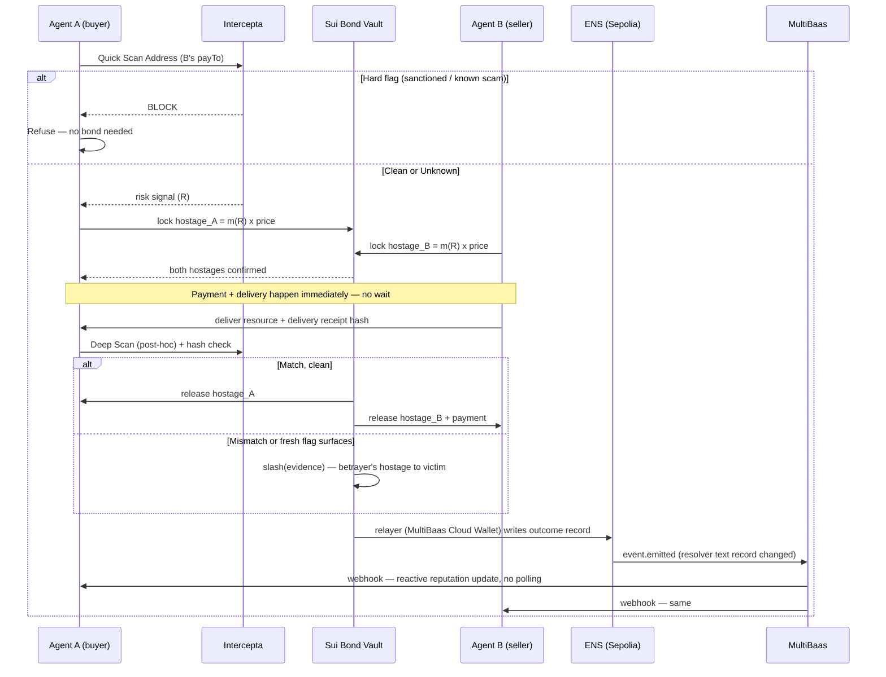

# Bonded — Hostage Protocol (Final)
### Automated customs bonds for agent-to-agent commerce

**Event:** ETHGlobal Tokyo 2026
**Sponsors targeted:** Intercepta ($2,000/$500 cont.) · Sui ($5,000) · World — ID for Agents ($5,000/$5,000 cont.) · ENSv2 ($6,000/$4,000 cont.) · Curvegrid — Best AI Agent Project ($1,000), plus Best Digital Asset Dashboard ($1,000) as a genuine, zero-extra-build bonus
**Sponsors deliberately not targeted:** 1inch, Uniswap Foundation (no swap in this story — forcing one in reads as cosmetic); Curvegrid's RWA Tokenization track (no real-world asset here — same honesty rule as above, not a special exception)

This supersedes the earlier draft. Everything that changed from that version is because of two things: adding Curvegrid as a real, load-bearing integration rather than an optional afterthought, and tightening the UI spec and qualification checklist after comparing against a competing design.

---

## Part A — The idea, in one page

**The failure every screening project this weekend will hit and quietly ignore.** Intercepta's API returns three kinds of verdict: bad (sanctioned, scam-linked, drainer-approved), good (clean history), and *unknown* — an address it has never seen before. Every "gate" project — check, then allow or block — has no good answer for unknown. Block it, and you've killed commerce with every new agent that has no track record yet, which is most agents on day one of an agent economy. Allow it, and you've built a screener that only works on people already caught once.

**The mechanism that actually solves this, not around it.** This is not a new invention — it's a real, centuries-old trade practice, automated. A customs bond is how goods have always moved before duties are verified: the importer posts a bond larger than the goods' value, the goods release instantly, and the bond — not an inspector — is what makes cheating irrational. Apply that literally to agent-to-agent payment: **before either agent commits, both post a stake larger than the value of what's changing hands.** Delivery and payment can happen immediately — no escrow wait, no manual review — because the arithmetic of betrayal is negative. A scammer has to risk $60 to steal $50. Rational agents don't take a losing bet.

**Where Intercepta fits precisely.** Not as the gate — as the *evidence oracle*. A hard flag (sanctions, known scam, drainer approval, fake token) still refuses instantly, no bond needed. Where Intercepta becomes load-bearing is the unknown case: it doesn't have to say yes or no anymore, it only has to say *how much collateral this risk level requires* — and, after the fact, it's the live re-scan that supplies the proof when a slash is triggered.

**Where Curvegrid fits precisely (new in this revision).** ENSv2 lives on Sepolia — an EVM chain MultiBaas already supports natively. MultiBaas becomes the event layer between the on-chain bond outcome and everything that reacts to it: a webhook fires the instant a settlement or scar is written to an agent's ENS record, driving the live UI feed and the counterparties' own reputation checks, with zero polling anywhere in the system. The relayer that's authorized to write those records signs through a MultiBaas Cloud Wallet, not a hot key sitting in an env file. This is not decoration — it's the actual event bus and the actual signer.

**The one-sentence pitch:** *Two AI agents that have never met transact instantly and safely — not because a filter caught the risk, but because the bond made lying a losing bet.*

**Why "Bonded" is still the right name.** "Licensed and bonded" is the actual term for a merchant you can trust with money before delivery. This isn't a metaphor borrowed for flavor — it's a customs bond, mechanically, automated for agents instead of shipping containers.

---

## Part B — Why this beats every gate and every pure-market idea

| Approach | What it does with "unknown" | Demo beat | Weakness a judge finds in 30 seconds |
|---|---|---|---|
| Simple gate (block/allow) | Refuses or blindly trusts | "Watch it get blocked" | Kills commerce with every new counterparty — the case that matters most in a young agent economy |
| Reputation market (bet on trust) | Prices it via a market | "Watch the price crash" | Needs liquidity and time to converge; doesn't help a one-off, first transaction — the common case. Worse: if the market price doesn't actually gate the payment (the screening verdict does that separately), the market is decoration around a plain gate, not a replacement for one |
| **Hostage settlement (this project)** | Prices the *risk* into a collateral requirement that makes betrayal irrational regardless of history | "Watch two strangers transact in 5 seconds — then watch a cheat get slashed on-chain, on camera" | Requires a real capital lockup — solved by keeping the lock window short and the demo scripted to one round-trip |

Whiteboard proof, thirty seconds: **stake > payment value ⇒ expected value of cheating is negative ⇒ a rational agent doesn't cheat.** Everything else here is instrumentation around that one inequality.

---

## Part C — The mechanism, precisely

### C.1 Actors

- **Agent A (buyer)** — autonomous, paying over x402 for a resource (a dataset, an API call, compute).
- **Agent B (seller)** — autonomous, offering the resource behind an x402 paywall.
- **Bond Vault** — a Sui object holding both hostages for the duration of one transaction.
- **Oracle** — Intercepta, called live at two moments: pre-commit (risk pricing) and post-delivery (evidence for slash, if triggered).
- **Identity Layer** — World ID for Agents; binds each agent to one verified human owner, and gates recovery after a slash.
- **Name Layer** — ENSv2 on Sepolia; every agent has a subname carrying its public bond history.
- **Event Layer (new)** — MultiBaas, watching the ENS registry/resolver contracts on Sepolia and pushing real-time webhooks whenever a record changes.

### C.2 The flow



### C.3 Dynamic stake sizing

```
R = risk_score(Intercepta response)     // 0 = clean history, 1 = maximum soft-risk signal
R_unknown = 0.6                          // fixed, disclosed value for "no data yet" —
                                          // moderate, never treated as proven-bad
m(R) = 1.05 + 1.5 x R                    // floor 1.05 so betrayal is never rational, even at R=0
                                          // cap at 3.0 so a legitimate new agent isn't priced out
hostage = m(R) x transaction_value
```

Both sides compute and post `hostage` independently — the buyer's hostage protects the seller against a payment later reversed or sourced from dirty funds; the seller's hostage protects the buyer against a resource that was never actually delivered.

### C.4 What triggers a slash

1. **Payment-side betrayal** — a fresh Intercepta Deep Scan at settlement surfaces a flag not visible at quote time. Evidence = the scan response, timestamped and stored.
2. **Delivery-side betrayal** — the delivered resource's hash doesn't match the seller's pre-payment commitment. Evidence = the mismatch, independently re-checkable by anyone.

Only these two conditions trigger a slash in this build — disclosed as a deliberate scope limit, not hidden.

### C.5 Failure modes, addressed rather than ignored

- **Collusion:** collateral only ever returns to its own poster on a clean settlement — nothing to gain by faking one together.
- **False-flag griefing:** both slash paths require externally checkable evidence attached to the call; a false claim fails the check and the false accuser's own hostage stays at risk instead — the deterrent is symmetric.
- **The oracle is wrong:** out of scope for a weekend build, stated plainly rather than hand-waved (Part J).

---

## Part D — UX as the architecture, not a layer on top of it

The core design decision: **the safety mechanism has no button.** Per-transaction human approval is the failure mode this project argues against, not a feature to add back in. The primary experience is two AI agents transacting with nobody watching in real time; the UI's job is to make that invisible safety legible after the fact.

### D.1 Visual language — "The Wharf"

Customs-and-bonded-warehouse motif, literal rather than decorative now that the mechanism is a real customs bond. Concrete tokens, not vague direction:

- **Palette:** base `#0E1210` (warehouse dusk) · panel `#171D1A` · hairline `#232B27` · manifest ink `#D8D2C2` (aged paper text) · bond green `#3FA37A` (released) · hold amber `#D9A441` (unknown, priced) · seized red `#C2452C` (slashed).
- **Type:** a serif or slab face for headings (customs-ledger feel — e.g. IBM Plex Serif) + JetBrains Mono `tabular-nums` for every amount, timestamp, and address. Numbers never move in a proportional font.
- **Motion budget — three animations only, no more:** (1) a stamp-press motion marking a transaction RELEASED or SEIZED, (2) the manifest line-item sliding in as each webhook event arrives, (3) the scar mark appearing on an agent's profile page the instant its record updates. Rehearse the stamp; it's the demo's visual signature.

### D.2 The three screens that exist

1. **The Wharf** — a live manifest, one line per in-flight transaction: agent names (resolved via ENS), amounts, live risk multiplier, and a stamp that updates as the flow executes, driven entirely by MultiBaas webhooks — no polling loop anywhere in the frontend. This is the only screen a human watches during the demo, and it doubles, honestly, as Curvegrid's Best Digital Asset Dashboard entry: it's a real dashboard over real pool balances and bond positions, fed by MultiBaas's event indexing — not a repurposed screen wearing a second label.
2. **Agent Manifest** (`agentname.agents.eth` profile page) — resolves ENS text records: verified-since date, clean settlement count, scar records with evidence hashes. The portable-reputation payoff — resolvable by anyone, not just this app.
3. **Recovery Desk** — the one screen with a human-facing button, because World's own brief requires a demonstrable denied/expired path: a scarred agent is locked from new bonds until its owner completes a fresh World ID verification. Show a denial and a success, back to back.

### D.3 The demo's woah moment, choreographed

Not "watch it get blocked." **Watch two agents that have never interacted settle a real transaction in under five seconds, zero human input — then watch a scripted cheat get its stake seized live, on the Sui explorer, with the Wharf's manifest line stamping SEIZED in real time because a webhook just told it to, not because someone refreshed a page.**

---

## Part E — Sponsor technology map

| Sponsor / Track | $ | Exactly what's used | Why it's non-cosmetic | Why it should make them glad, not just satisfied |
|---|---|---|---|---|
| **Intercepta** — Safe A2A Payments | 2,000 | Quick Scan pre-commit for hard-flag refusal; Deep Scan as the post-settlement slash trigger; live, on every transaction, pricing a real dynamic value (the stake multiplier) | The verdict *becomes an economic input*, not a checkbox | Their own brief names "unknown" as the hard case; this visibly solves it instead of quietly refusing it |
| **Sui** — DeFi & Payments | 5,000 | The Bond Vault: lock/settle/slash as object-state transitions, no signature-leak surface, no replay risk | Matches "vaults and capital allocators," "automation systems" exactly | A genuinely new use of object-consumption semantics for adjudication |
| **World** — ID for Agents | 5,000 | Identity binding at creation; a real denied/expired recovery flow gating a slashed agent's return to service | Fresh verification at a moment that actually matters — recovering trust after a proven lie | Their brief wants "a meaningful action that needs human identity, not a login screen" — this is that, verbatim |
| **ENS** — Best Use of ENSv2 | 6,000 | Agent subnames under Enhanced Access Control; bond history in Agent Text Records (ENSIP-26) | The name is the access-control boundary and the reputation ledger, not a label | Uses their own emerging ENSIP standard instead of inventing a field |
| **Curvegrid** — Best AI Agent Project | 1,000 | MultiBaas webhooks (`event.emitted` on the ENS resolver/registry contracts, confirmed live on Sepolia) drive both agents' reactive reputation checks — an "On-Chain Monitoring Agent," their own listed example, built for real, not polled | The agent *reacts* to on-chain state the instant it changes; no cron job pretending to be automation | Both agents are also, structurally, their "Policy-Aware Transaction Agent" / "Agent-to-Agent Payments" examples — verbatim fit |
| **Curvegrid** — Best Digital Asset Dashboard | 1,000 (bonus) | The Wharf, already built for the core demo, is the dashboard — fed by MultiBaas event indexing over real pool and bond balances | No extra build — same screen, same data, an honest second entry | Costs nothing beyond checking their README box; the dashboard is real, not repurposed marketing |

---

## Part F — Internal architecture

### F.1 Repository layout

```
bonded-hostage/
├─ move/
│  ├─ sources/
│  │  ├─ bond_vault.move          # lock / settle / slash — the whole economic core
│  │  └─ bond_vault_tests.move
│  └─ Move.toml
├─ agents/
│  ├─ buyer_agent.ts               # autonomous policy loop: quote, price risk, lock, verify, settle
│  ├─ seller_agent.ts              # mirror of buyer_agent, seller side
│  └─ risk.ts                      # stake-sizing formula (C.3), Intercepta client
├─ ens/
│  ├─ register-subname.ts          # ENSv2 Permissioned Registry calls
│  └─ write-record.ts              # writes settlement/scar text records (ENSIP-26 schema)
├─ identity/
│  └─ world-flow.ts                # World ID for Agents sandbox — bind, verify, recover
├─ curvegrid/                       # NEW
│  ├─ multibaas-client.ts          # REST client, event indexing queries
│  ├─ webhook-receiver.ts          # receives event.emitted from ENS resolver/registry
│  └─ cloud-wallet-relayer.ts      # oracle-role signer via MultiBaas Cloud Wallet (KMS-backed)
├─ web/                              # "The Wharf" — manifest feed, agent profile, recovery desk
│  └─ (Next.js, or a single static page for a lean build)
├─ docs/
│  └─ THREATMODEL.md                # Part C.5, written before any other doc
├─ FEEDBACK/
│  ├─ intercepta.md · world.md · ens.md · sui.md · curvegrid.md
└─ README.md
```

### F.2 `bond_vault.move` — function sketch

```move
public struct Bond has key, store {
    id: UID,
    payer_stake: Balance<T>,
    seller_stake: Balance<T>,
    payment: Balance<T>,
    tx_ref: address,        // links back to the x402 payment authorization
}

public struct SlashEvidence has drop {
    kind: u8,                // 1 = payment-side, 2 = delivery-side
    proof_hash: vector<u8>,  // Intercepta response hash, or delivery-hash mismatch
}

public fun lock(payer_stake: Balance<T>, seller_stake: Balance<T>, payment: Balance<T>, tx_ref: address, ctx: &mut TxContext): Bond
public fun settle(bond: Bond): (Balance<T>, Balance<T>, Balance<T>)   // clean path
public fun slash(bond: Bond, evidence: SlashEvidence, cap: &EnforcerCap): (Balance<T>, Balance<T>)  // betrayer's stake to victim
```

`EnforcerCap` is a capability object, not a signature — a narrower attack surface than a leakable key.

### F.3 MultiBaas wiring (new, concrete)

- Deploy the ENSv2 registry/resolver contracts on Sepolia (already required by the ENS track) and add them to a MultiBaas deployment targeting Sepolia — directly supported, no custom RPC plumbing needed.
- Enable `event.emitted` sync on the resolver contract; create a webhook pointed at `curvegrid/webhook-receiver.ts`.
- The oracle relayer role — the one address Enhanced Access Control permits to write settlement/scar records — is provisioned as a MultiBaas Cloud Wallet (KMS-backed), not a raw private key in `.env`.
- `buyer_agent.ts` / `seller_agent.ts` subscribe to the same webhook stream instead of polling ENS before every new counterparty interaction — this is the "reactive" behavior that makes the Curvegrid AI Agent case real rather than asserted.

### F.4 Off-chain agent loop

```
1. Resolve counterparty's ENS name → check locally-cached reputation (kept fresh by MultiBaas webhooks, not polling)
2. Call Intercepta Quick Scan Address on payTo → hard flag: refuse, stop; else continue
3. Compute R from Intercepta's soft signals + "no history" fallback (C.3)
4. Compute own hostage = m(R) x price; call move.lock with own stake
5. Wait for counterparty's stake to also land in the same Bond object
6. Execute the x402 payment / resource delivery
7. Call Intercepta Deep Scan (post-hoc) + verify delivery hash
8. Call move.settle() if clean, or move.slash() with evidence if not
9. Relayer (MultiBaas Cloud Wallet) writes result to ENS text record
10. MultiBaas fires event.emitted → webhook → Wharf + both agents update instantly
```

### F.5 ENS record schema (ENSIP-26 aligned)

```
agent.eth text records:
  verified-since:      <ISO date, from World ID binding>
  bond.settled.count:  <integer>
  bond.scar.count:     <integer>
  bond.scar.latest:    <tx hash of most recent slash, if any>
```

---

## Part G — How to use the sponsor docs, mapped to what you're building

| When you're building... | Read this doc first | What you're specifically looking for |
|---|---|---|
| `risk.ts` (Intercepta client) | [Quick Scan Address](https://docs.web3antivirus.io/reference/quick-scan-address) then [Deep Scan Address](https://docs.web3antivirus.io/reference/scan-address) | Exact response shape for hard flags vs. soft risk signals — decides `R` in C.3 |
| Payment-authorization check | [Scan Message](https://docs.web3antivirus.io/reference/scan-message) | Whether the x402 authorization itself, not just the address, carries a flag |
| Token legitimacy check | [Scan Token](https://docs.web3antivirus.io/reference/scan-token) | Real USDC vs. a lookalike — run once, cache |
| x402 payment flow | [buyers](https://docs.x402.org/getting-started/quickstart-for-buyers) / [sellers](https://docs.x402.org/getting-started/quickstart-for-sellers) quickstarts | The HTTP 402 challenge/response shape both agents speak |
| `bond_vault.move` | [Sui docs](https://docs.sui.io) + [Sui Stack Hello World](https://github.com/MystenLabs/sui-stack-hello-world) | Object ownership and capability patterns — read before writing `lock`/`settle`/`slash` |
| `identity/world-flow.ts` | [World ID for Agents docs](http://sandbox.auth.world.org/docs) + [AgentPlugin](https://github.com/worldcoin/world-id-agent-plugin) | Sandbox auth-request/callback shape — proofs are currently mocked per World's own event notice, build against that explicitly |
| `ens/register-subname.ts` | [Permissioned Registry](https://docs.ens.domains/ensv2/permissioned-registry) + [Enhanced Access Control](https://docs.ens.domains/ensv2/enhanced-access-control/) | Scoping a role to write only specific text records |
| `ens/write-record.ts` | [ENSIP-26](https://docs.ens.domains/ensip/26/) + [ENSIP-25](https://docs.ens.domains/ensip/25/) | Their actual proposed agent-record schema, not an invented one |
| `curvegrid/webhook-receiver.ts` | [MultiBaas Webhooks](https://docs.curvegrid.com/multibaas/webhooks) | `event.emitted` vs `transaction.included` — this build only needs `event.emitted` on the resolver contract |
| `curvegrid/cloud-wallet-relayer.ts` | [Introduction to MultiBaas](https://docs.curvegrid.com/multibaas/) | Cloud Wallet setup (KMS-backed signer) and confirm Sepolia is enabled on your deployment — it is, per their supported-chains list, but confirm on your own console at provisioning time |

---

## Part H — Qualification matrix (verbatim requirement → exactly what satisfies it)

| Sponsor | Their requirement, as written | Satisfied by |
|---|---|---|
| Intercepta | "At least one live call... runs before a payment is signed or accepted, and its result decides what happens next. Mocked... don't qualify." | `risk.ts` — live Quick/Deep Scan, no cache, decides refuse vs. stake size, every transaction |
| Intercepta | "Your demo shows one payment that goes through and one that is blocked or held, with the reason visible." | Demo beats 2 & 3 (Part I) — clean settle, then a scripted slash with the Intercepta/hash evidence shown on screen |
| Sui | "Systems that move, manage, and transform money programmatically... Vaults and capital allocators." | `bond_vault.move` — literally a vault; lock/settle/slash are the capital-allocation logic |
| World | "Demonstrate the complete journey... and a denied, expired, cancelled, or otherwise unsuccessful path." | Mint flow (success) + Recovery Desk (denial, then a fresh successful verification) — both filmed |
| World | "Validate identity results in a secure backend; do not expose client secrets." | `world-flow.ts` — server-side validation only |
| ENS | "ENSv2 features should be central to the product, not a cosmetic add-on." | Enhanced Access Control is the actual write-permission boundary on reputation; subnames are the actual namespace transactions key against |
| Curvegrid (AI Agent) | "AI agents... analyze wallets, contracts, or transactions and surface unusual activity." | Both agents react to MultiBaas `event.emitted` webhooks — reputation changes surface to them instantly, no polling |
| Curvegrid (Dashboard) | "Build a dashboard that helps users understand their digital assets... make better operational decisions." | The Wharf — real pool/bond balances, fed by MultiBaas event indexing |
| Curvegrid (README) | 5-point structure: summary, MultiBaas usage, team+handles, setup, MultiBaas feedback | `README.md` Part K checklist below |

---

## Part I — Demo script (the beats, timed)

1. **0:00–0:20** — One sentence on the failure mode (Part A), on screen: "Screening tells you yes or no. It has no good answer for 'never seen this before.' We built the thing that does."
2. **0:20–0:45** — Live: Agent A and B, zero history, transact over x402. The Wharf shows risk quoted, hostages locked, resource delivered, both stamps release — five real seconds, no cuts, manifest line updating via MultiBaas webhook, not a refresh.
3. **0:45–1:15** — Live: a scripted rogue seller delivers a hash-mismatched resource. Watch the slash fire, the seizure on the Sui explorer, and the manifest stamp flip to SEIZED — driven by the same webhook path, so the audience sees automation, not a demo trick.
4. **1:15–1:35** — Recovery Desk: the scarred agent tries to reopen a bond — refused, locked. Its owner completes a fresh World ID verification — unlocked. Denial and success, back to back, on camera.
5. **1:35–1:45** — Close: "Nobody approved anything. The math did — and the dashboard just watched it happen in real time."

---

## Part J — Honest disclosure — what this deliberately does not do

State this plainly in `docs/THREATMODEL.md`, first, before any other documentation:

> "This build has exactly two slash conditions: a fresh Intercepta flag on the payment side, and a delivery-hash mismatch on the resource side. It does not arbitrate a disputed delivery where both sides have a plausible story, and it does not defend against a compromised `EnforcerCap` beyond the object-capability boundary itself. We'd rather say precisely where the mechanism's proof stops than dress a narrower system up as a general one."

---

## Part K — Build schedule, with a real kill gate

| Day | Deliverable | Gate |
|---|---|---|
| 1 AM | `bond_vault.move` skeleton (`lock`/`settle`); Intercepta key requested; pinned test addresses collected from Discord — non-negotiable, do this before anything else | Move package ID live on Sui testnet |
| 1 PM | **MultiBaas spike: deployment provisioned on Sepolia, one webhook firing on a test contract event.** | **KILL GATE — if this isn't working by tonight, cut to plain polling for the Wharf feed and drop the Curvegrid AI Agent claim to "in progress," keep only the Dashboard entry if any MultiBaas usage landed at all** |
| 2 | `risk.ts` live against pinned addresses; stake formula (C.3) tested; `bond_vault_tests.move` green for clean path | Hard-flag, clean, and unknown cases all price correctly |
| 3 | `slash()` implemented with both evidence kinds; one scripted rogue-seller scenario working end-to-end on testnet | Slash video captured |
| 4 | ENS subname registration + Enhanced Access Control roles live on Sepolia; text-record schema writing correctly; MultiBaas webhook wired to the real resolver contract | A real (not hard-coded) profile page resolves; webhook fires on a real record write |
| 5 | World ID for Agents sandbox flow: bind, and the recovery/denied path; Cloud Wallet relayer replacing the placeholder key | Denied-path video captured |
| 6 | The Wharf UI wired to live MultiBaas + Sui events end-to-end | Full demo script (Part I) runs without a human touching anything except the Recovery Desk button |
| 7 | README, all `FEEDBACK/*.md` (including `curvegrid.md`), `docs/THREATMODEL.md`, final video, submission forms per sponsor | Every row in Part H's qualification matrix ticked, none assumed |

**Cut order if behind:** MultiBaas Cloud Wallet relayer (fall back to a plain key, disclose it) → ENS text-record polish → Wharf visual polish (keep the raw event log if the stamp animation isn't done). **Never cut:** the slash proof, the World denied-path video, the live Intercepta call, or the MultiBaas webhook itself — losing that last one costs you the entire Curvegrid AI Agent claim, not just a polish point.

---

## Part L — Submission checklist, per sponsor's own words

- **Intercepta:** live call before signing/accepting, decides real behavior; one payment through, one held/blocked, reason visible; README points to `agents/risk.ts` line-for-line; 3–5 lines of feedback in `FEEDBACK/intercepta.md`.
- **Sui:** real object-state transitions on testnet shown live, not a local-fork claim.
- **World:** complete journey *and* a denied/expired path, both on camera; server-side validation only.
- **ENS:** ENSv2 features structurally load-bearing; live demo link; open-source repo.
- **Curvegrid:** README with all five required sections (one-sentence summary; how MultiBaas was used; team intro + social handles; setup/testing instructions; MultiBaas feedback — wins, friction, challenges); submit for both the AI Agent and Dashboard tracks since one honest build satisfies both.

---

## Part M — Open items to verify before Day 1 ends

1. **[VERIFY]** Exact `@mysten/sui` SDK package name and current object-transfer API against `docs.sui.io`.
2. **[VERIFY]** World ID for Agents sandbox's current mocked-proof callback shape — confirm it hasn't changed since the event notice was written.
3. **[VERIFY]** ENSv2's exact Enhanced Access Control role-scoping call signature for restricting a role to specific text-record keys only.
4. **[VERIFY]** Confirm your specific MultiBaas deployment has Sepolia enabled at provisioning time (it's on their supported list, but confirm per-deployment, not assumed from the docs page).
5. Decide, as a team, the exact wording of the Part J disclosure before any other README content is written — it anchors the tone for everything that follows it.
