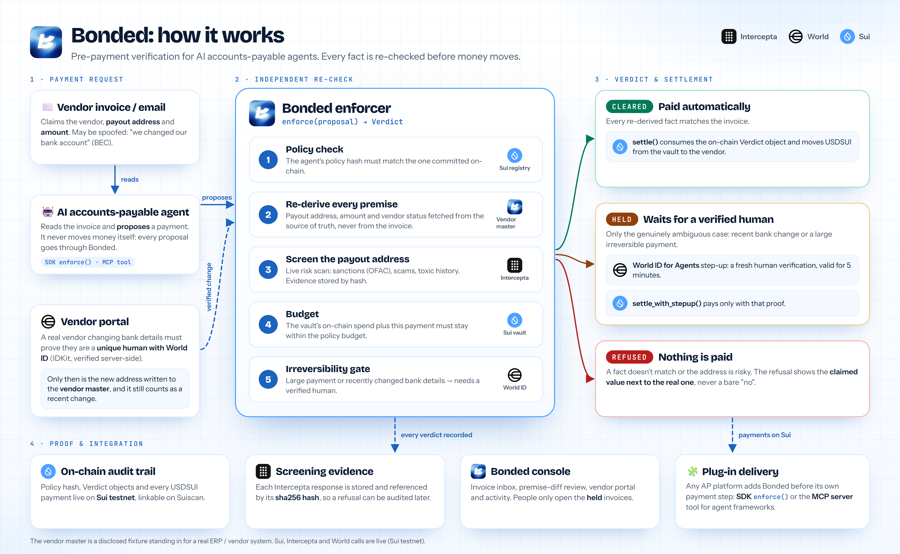

# Bonded

**Pre-payment verification for AI accounts-payable agents.** An AI agent pays your vendor invoices. Before any money moves, Bonded re-derives every fact the payment relies on from sources an attacker can't edit, and the agent can only pay by consuming an on-chain verdict that says those facts checked out. This is enforced by the object graph on Sui, not by application code that a spoofed email or a future refactor could talk its way around.

Bonded does two things. First, it takes the payment the agent *proposes*, meaning the vendor, the payout address, the amount, and whether the vendor is active, and re-fetches each of those facts from the vendor master rather than trusting the invoice. It also screens the payout identity with Intercepta. A mismatch or a risky address is a refusal, and the refusal always carries the claimed value next to the real one.

Second, it turns the result into a one-use `Verdict` object on Sui. Funds leave the company vault through exactly two Move functions, and both destroy that verdict on the way in:
- **Clean facts, routine amount:** the payment is `CLEARED` and `settle()` pays automatically.
- **Recent bank change or a payment over the irreversible threshold:** the only remaining door is `settle_with_stepup()`, which also needs a `StepUpApproval` minted after a fresh World ID verification of a human.

There is no approve button on routine invoices, no boolean to forget to check, and no code path that moves the vault's balance without consuming a verdict.

- **Network:** Sui testnet
- **Contracts:** [`move/sources`](move/sources)
- **App:** Next.js 16 (App Router), in [`apps/console`](apps/console)
- **Engine:** [`packages/enforcer`](packages/enforcer), an installable SDK (`enforce()`), plus [`packages/mcp-server`](packages/mcp-server) for agent frameworks
- **Hosted frontend:** [bondedai.vercel.app](https://bondedai.vercel.app). The UI is hosted there, but payments are signed by the Sui CLI on the operator's machine, so run it locally to pay (see §5).
- **Operator scripts:** [`apps/console/scripts`](apps/console/scripts)



## 1. The wound this is built against

**Business Email Compromise cost $3.04 billion in 2025.** It is the FBI IC3's #2 crime type by total dollar loss, with an average loss of about $123,000 per incident, and 86% of the money moves by wire or ACH before anyone notices ([2025 IC3 Annual Report](https://www.ic3.gov/AnnualReport/Reports/2025_IC3Report.pdf)).

The attack is simple:
1. An attacker impersonates a real vendor.
2. They send a spoofed invoice, or a "we changed our bank account" email.
3. Accounts payable pays the attacker.

This is the concrete reason enterprises still refuse to let an AI agent run payables on its own. An agent that trusts the invoice pays the attacker, and a guardrail that lives in the agent's prompt or in application code is only as strong as the next refactor.

**Bonded's claim:** the agent can be fully fooled, because a spoofed invoice is treated as expected, not hypothetical, and still be structurally unable to:
- pay an address the vendor master doesn't hold;
- pay a sanctioned or scam-linked payee;
- pay a changed bank account without a verified human's approval.

## 2. The product

```bash
pnpm install
pnpm build
pnpm --filter @bonded/console dev     # http://localhost:3000
```

The console is an accounts-payable desk where the AI agent has already done the work. People only look at what was held.

- **Overview (`/`):** the pitch, live ledger totals and Suiscan links for real payments.
- **Invoice Inbox (`/invoices`):** every invoice with the agent's verdict: *Paid*, *Refused* with its reason, *Held: needs approval*, or *Cleared, not yet paid*.
- **Invoice review (`/invoices/[id]`):** the premise-diff table, showing claimed value against re-derived value for every fact, with the verdict stamp and the Sui transaction.
- **Step-up (`/stepup`):** the only human action in the payment flow. A fresh World ID for Agents verification releases a held payment. It is offered only above the irreversible threshold or for a changed bank account, never for every invoice.
- **Vendor portal (`/vendor/bank-change`):** the vendor's side of a bank change. The vendor's representative verifies with World ID (IDKit, passport credential) before a new payout address is even on file.
- **Activity (`/activity`):** a read-only audit trail over the settlement ledger, the vendor-master change log and the IDKit request store.

Every figure is read from real stores or from the chain. There is no placeholder data.

The demo inbox gives the agent five ordinary invoices. What differs is what each one runs into:

| Invoice | What the agent walks into | Outcome |
|---|---|---|
| Acme Supplies, $1,250 | Clean: every fact matches the vendor master | **CLEARED**, paid automatically on Sui |
| Globex Freight (spoofed) | A "we changed banks" email pointing at an OFAC-listed Lazarus Group address | **REFUSED** by the live Intercepta screen, before any signature |
| Suspended Corp | A vendor the vendor master marks suspended | **REFUSED**, showing the claimed status next to the real one |
| Globex Freight, $8,450 (genuine bank change) | A real, recent payout-address change | **HELD**, paid after World ID step-up |
| Halcyon, $15,000 | Over the $10,000 irreversible threshold | **HELD**, paid via `settle_with_stepup` |

`pnpm --filter @bonded/console demo:reset` puts the demo back to the start:
- it archives the local state;
- it creates and funds a fresh vault on testnet;
- it runs the agent over the inbox, so cleared invoices are paid and only the held ones wait for a person.

## 3. Design decisions

| Decision | Why |
|---|---|
| **Facts are re-derived, never read from the invoice** | The invoice is the attacker's document. The payout address is always taken from the vendor master, and settlement pays that address, never the one the invoice claims. |
| **Verdicts are consumed, not checked** | A boolean that a function reads and moves past can be refactored away without anyone noticing. A `Verdict` object must be passed into `settle` and is destroyed there, so removing the check removes the ability to spend at all. It also can't be replayed. |
| **The policy is committed on-chain** | The agent's policy (budget, thresholds, which premises to check) is canonicalised and hashed, and the hash is stored in `BondedRegistry`. If the agent runs a different policy than the one committed, the result is `STALE_POLICY`. |
| **The budget is read from the chain** | The spend check uses the vault's on-chain `spent_this_period`, not a local counter the app could get wrong. |
| **A human is asked only when it matters** | Approving every invoice trains people to rubber-stamp. The step-up fires only for a recent bank change or an irreversible amount (`PREMISE_HELD_FOR_REVIEW` / `IRREVERSIBLE_UNCONFIRMED`). There is no approve button anywhere else. |
| **Two World products, two different people** | The vendor's representative proves who asked for the bank change (IDKit). The payer's controller freshly approves the payment (World ID for Agents). The controller's approval of a bank change only succeeds when a matching IDKit-verified vendor request exists. |
| **Intercepta runs before any signature and fails closed** | With no key or a failed call, the screened invoices are refused (`PREMISE_UNRESOLVABLE`), never passed. The raw response is stored by its sha256 hash as evidence. |
| **World ID tokens are verified server-side only** | The step-up's ID token is verified against World's live JWKS on the server, so the browser never holds anything a "verified" state could be forged from. |
| **Money is bigint fixed-point, never a float** | Every USDC amount is a `bigint` or a 6-decimal string. The arithmetic lives in one place: `packages/seam/src/money.ts`. |
| **No signing keys in the repo or `.env`** | Sui signing goes through the Sui CLI keystore (`sui client ptb`, called with `execFile` and an argument array). The code never reads key bytes. |

## 4. The contracts

| Module | Responsibility |
|---|---|
| [`bonded_vault.move`](move/sources/bonded_vault.move) | The only place spending authority exists. `Vault<T>` holds the funds. `mint_verdict` and `mint_stepup_approval` need the `EnforcerCap`. `settle` and `settle_with_stepup` are the only two functions that move the vault's balance, and both consume their `Verdict` (and the `StepUpApproval`) before any transfer. `spent_this_period` feeds the budget check. |
| [`bonded_registry.move`](move/sources/bonded_registry.move) | `BondedRegistry`: `commit_policy` stores the agent's policy hash, and `current_policy_hash` is what `enforce()` compares against. |

Tests are in [`move/tests`](move/tests): 14 Move unit tests (10 vault, 4 registry). They cover:
- verdict replay and consumption;
- a step-up approval that doesn't match its proposal;
- a non-cleared verdict passed to `settle`;
- the capability checks.

Run them with `pnpm move:test`.

## 5. Configuration and deployment

### Prerequisites

- Node 20+ and pnpm 10
- The `sui` CLI, with a funded testnet address in its keystore ([faucet](https://faucet.sui.io))
- An HTTPS tunnel (for example ngrok) for the World ID for Agents redirect

### Run it

```bash
pnpm install
cp .env.example .env            # fill in the keys below; .env is never committed
pnpm build
pnpm --filter @bonded/console commit:policy   # commit the agent's policy hash on Sui
pnpm --filter @bonded/console demo:reset      # fresh funded vault + the agent reviews the inbox
pnpm --filter @bonded/console dev
```

### Environment

Nothing is faked when a key is missing. Every missing key makes its part fail visibly.

| Variable | Purpose | Unset behaviour |
|---|---|---|
| `SUI_BONDED_PACKAGE_ID`, `SUI_VAULT_ID`, `SUI_REGISTRY_ID`, `SUI_ENFORCER_CAP_ID`, `SUI_BOND_COIN_TYPE`, `SUI_NETWORK`, `SUI_RPC_URL` | The deployed package, vault, registry and settlement coin (see §6). `demo:reset` updates `SUI_VAULT_ID`. | `/api/enforce` refuses with an on-chain policy error naming the missing variable. |
| `INTERCEPTA_API_KEY` | Live payee screening | Screened invoices fail closed: `REFUSED` / `PREMISE_UNRESOLVABLE`. |
| `WORLD_SANDBOX_CLIENT_ID`, `WORLD_SANDBOX_CLIENT_SECRET`, `WORLD_REDIRECT_URI` | World ID for Agents step-up (OIDC with PKCE; the redirect must be HTTPS) | `/api/stepup` answers 501 naming the missing variables, so held invoices stay held. |
| `WORLD_IDKIT_APP_ID`, `WORLD_IDKIT_RP_ID`, `WORLD_IDKIT_ACTION`, `WORLD_IDKIT_SIGNING_KEY`, `WORLD_IDKIT_ENVIRONMENT`, `WORLD_IDKIT_STAGING_VERIFICATION_TOKEN` | Vendor bank-change verification with IDKit. The request is signed server-side, and staging needs the verification token. | The vendor portal answers `missing_env` and no request is signed. |
| `VENDOR_MASTER_SOURCE=xero`, `XERO_CLIENT_ID`, `XERO_CLIENT_SECRET`, `XERO_TENANT_ID` | Optional: read the vendor master from a real Xero organisation instead of the disclosed fixture | The disclosed fixture is used. |

Sui signing never uses `.env`. It goes through the Sui CLI keystore, and the app never reads key bytes. `WORLD_SANDBOX_CLIENT_SECRET` and `WORLD_IDKIT_SIGNING_KEY` are server-only and never reach a client bundle.

### Scripts

| Script | When to use it |
|---|---|
| `pnpm --filter @bonded/console commit:policy` | Once per policy change: commits the AP agent's policy hash to `BondedRegistry`. |
| `pnpm --filter @bonded/console demo:reset` | Before a demo. It archives local state to `.data/archive/`, creates and funds a fresh `Vault<USDSUI>` (`--fund N`, `--keep-vault`, `--no-agent`), then runs the agent. The budget is a vault-lifetime total, so a fresh vault is what "from the start" means. |
| `pnpm --filter @bonded/console demo:agent` | Runs the AP agent over the inbox again. It pays cleared invoices once (the settle-once ledger makes repeats a no-op) and leaves held ones held. |
| `pnpm --filter @bonded/issuer-oracle xero:setup` / `xero:check` | Seeds and reads back the Xero demo vendor master. |

### Tests

```bash
pnpm test          # TypeScript: enforcer ReasonCode branches, dispatcher, adapters, console lib
pnpm typecheck
pnpm move:test     # Move: verdict consumption, replay, step-up binding, capabilities
```

Tests exercise our own logic over our own inputs. No sponsor response is mocked anywhere.

## 6. Live on Sui testnet

| Object | Id |
|---|---|
| Package | `0xf3d914b39722e1c6c3f0e274d088623c0e050d3125b8f658d48b94498efbf57a` |
| `BondedRegistry` (shared) | `0x107a77efbd5ab5ba91d4ec1104205e254a14365484d694ec72a615bea2b912a5` |
| `EnforcerCap` | `0x60302c2c5682c685daf794b1acf0114bbcfea1d5873066d2860654b1ea5f375d` |
| Settlement coin | `0x832f93729a8b1dfe9dd8067536dfa35231cf019f9401afe04a398df6d18c54cb::usdsui::USDSUI` (6 decimals) |

Real payments made through the console, each confirmed against on-chain state:

| Scenario | Path | Transaction |
|---|---|---|
| Acme, $1,250 | `CLEARED` → `settle` | [`BkuSQ6nh…wP69`](https://suiscan.xyz/testnet/tx/BkuSQ6nhyEXBXvGs9X3kiX3WVgTkPZ9HAkEdNgDqwP69) |
| Globex genuine bank change, $8,450 | `HELD` → World ID step-up → vendor record updated → paid | [`6RGhLEKA…Th4G`](https://suiscan.xyz/testnet/tx/6RGhLEKACfW2i9FRf6ZZJRXBjyL7bxynae5GWus1Th4G) |
| Halcyon, $15,000 | `HELD` → World ID step-up → `settle_with_stepup` | [`GicsFH3P…6XAd`](https://suiscan.xyz/testnet/tx/GicsFH3P5W84eQsv1nFjJgcA1QKozkZ5JjhcZt256XAd) |

Two checks on the acme payment:
- **Settle-once ledger:** a second identical request for the acme invoice returned the same digest and submitted nothing.
- **Recipient:** the recipient was acme's vendor-master address, re-derived, not the address the invoice claimed.

Every digest, gas figure and vault balance is in [`move/DEPLOYMENTS.md`](move/DEPLOYMENTS.md). Each `demo:reset` creates a new vault. Old vaults and their full history stay on-chain.

## 7. Honest disclosure register

| Item | Status |
|---|---|
| Move contracts | Real and live on testnet. The clear path and the step-up path have both paid real invoices (§6). |
| `enforce()` | Real. Five checks, in order: policy hash, premise re-derivation, screening, budget, irreversibility. Every refusal or hold stores the claimed value next to the re-derived one. |
| Vendor master | **A disclosed fixture by default**, standing in for a real ERP or vendor system. It can be switched to a real Xero organisation (`VENDOR_MASTER_SOURCE=xero`), but that path hasn't been run live yet. |
| Intercepta | Real API calls. The spoofed Globex invoice was refused by a live Deep Scan of the OFAC-listed Lazarus address (`toxicScore` 100, five risk traits), and the clean payees screened with zero traits. Intercepta has no Sui support, so it screens the EVM identity the payee *claims*. A separate hard-refuse check ties that identity to the vendor's registered one. |
| World ID for Agents | Real sandbox OIDC. The ID token is verified server-side against the live JWKS within a 5-minute freshness window. It has approved real payments (§6). |
| World IDKit | Real verification through World's `/api/v4/verify`, with the request signed server-side. The staging Simulator only issues World ID 3.0 credentials, so the recorded proof is the passport preset's legacy document fallback. We don't claim a 4.0 passport proof. |
| Hosted frontend | [bondedai.vercel.app](https://bondedai.vercel.app) serves the UI. Payments need the Sui CLI keystore and the API keys, which exist only on the operator's machine, so the hosted app can't sign. Run it locally to pay. |
| Not built | A policy compiler (policies are hand-authored), a hosted multi-tenant gateway, binding a verified person to a vendor at onboarding, and a link between a World identity and a Sui account. |
| Honest boundary | Bonded does not judge intent. A payment that honestly matches the vendor master, passes screening and stays within budget will be paid. What Bonded guarantees is that every outflow either matches independently re-derived facts, or stopped and asked a verified human. |

The full threat model and the live build log are in [`docs/THREATMODEL.md`](docs/THREATMODEL.md).

## 8. Sponsor tracks

- **World:** the vendor side uses IDKit ([`apps/console/lib/idkit.ts`](apps/console/lib/idkit.ts)), and the payer side uses World ID for Agents step-up ([`packages/world-agents/src/flow.ts`](packages/world-agents/src/flow.ts), [`stepup-gate.ts`](packages/world-agents/src/stepup-gate.ts)).
- **Sui:** verdict-gated settlement ([`move/sources/bonded_vault.move`](move/sources/bonded_vault.move)), the policy registry, and automatic settlement from TypeScript ([`packages/sui-settlement`](packages/sui-settlement)).
- **Intercepta:** live payee screening before any signature ([`packages/intercepta-adapter/src/client.ts`](packages/intercepta-adapter/src/client.ts)), wired in through [`apps/console/lib/ap-policy.ts`](apps/console/lib/ap-policy.ts).

Integration notes on what was easy, what cost time and what we'd ask each sponsor to document are in [`FEEDBACK/`](FEEDBACK). The full sponsor detail is in [`sponsers.md`](sponsers.md).

## 9. Repo layout

```
move/                        Sui Move package (bonded_vault, bonded_registry) + tests, DEPLOYMENTS.md
packages/seam/               shared types, ReasonCodes, bigint fixed-point money
packages/enforcer/           enforce(): the five-step refusal/hold engine, no chain dependency
packages/dispatcher/         routes each premise to the adapter that owns it; canonical policy hash
packages/issuer-oracle/      vendor master: disclosed fixture or Xero; bank-change log
packages/intercepta-adapter/ live Intercepta client, evidence storage, risk premises
packages/world-agents/       World ID for Agents OIDC flow + step-up gate
packages/sui-settlement/     settleCleared / settleWithStepUp, on-chain reads
packages/mcp-server/         MCP tool bonded_verify_invoice_payment
packages/villain-corpus/     the spoofed-invoice artifact + no-mock enforce() harness
apps/console/                Next.js console: inbox, review, step-up, vendor portal, activity
apps/console/scripts/        commit-ap-policy, reset-demo, run-agent
docs/                        THREATMODEL, PROJECT_OVERVIEW, VERIFY_FINDINGS, architecture diagram
FEEDBACK/                    sponsor API and docs feedback (World, Intercepta, Sui)
```

## How it's delivered

- **SDK:** any AP platform's backend calls `enforce(proposal, policy, onchainPolicyHash, deps)` before executing a payment. There is no service to stand up.
- **MCP plugin:** `packages/mcp-server` exposes one tool, `bonded_verify_invoice_payment`, to any MCP-capable agent framework. Both integration paths are shown side by side in [its README](packages/mcp-server/README.md).
- **Hosted gateway:** a multi-tenant hosted gateway is roadmap, not built.

## Further reading

- [`BONDED_PRD.md`](BONDED_PRD.md): the full spec and design rationale.
- [`docs/PROJECT_OVERVIEW.md`](docs/PROJECT_OVERVIEW.md): the problem, the flow diagrams and a competitor analysis.
- [`docs/architecture/architecture.html`](docs/architecture/architecture.html): the architecture diagram with a written walkthrough.
- [`USECASE.md`](USECASE.md): the BEC use case in detail.

## License

MIT. See [`LICENSE`](LICENSE).
