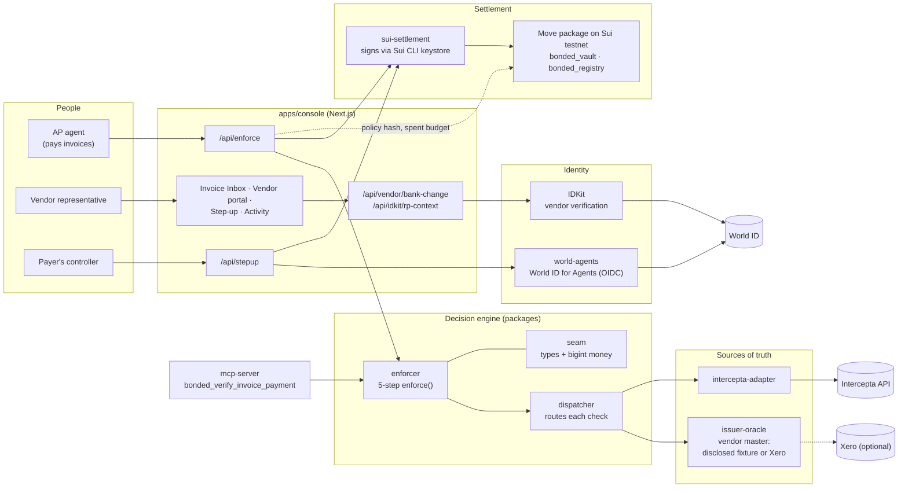
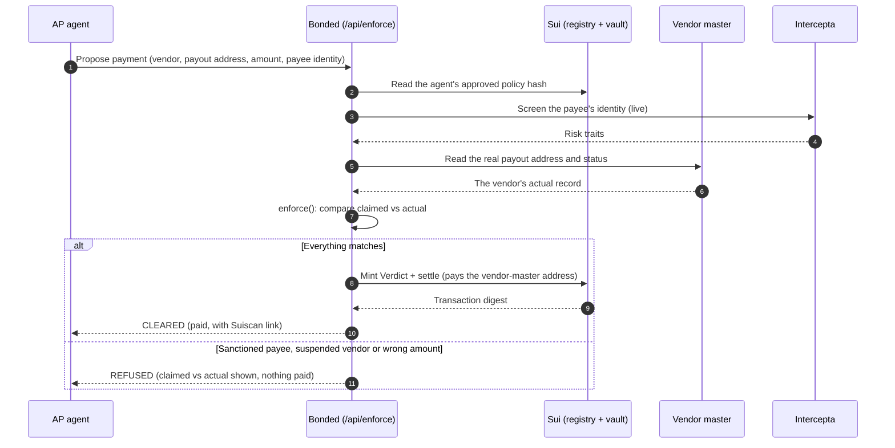
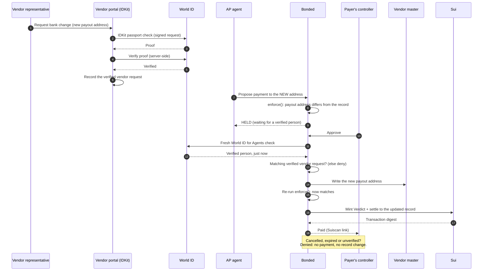

# Bonded: project overview

**Bonded checks an AI agent's payment before the money moves.** It independently re-checks the facts a
vendor payment depends on, against the vendor's own records and live risk data. Clear cases are
paid automatically on Sui. A person is brought in only for the one ambiguous moment: a change to
the vendor's bank details. That person is verified with World ID.

Everything below describes what is built and has run live on testnet. See
[`THREATMODEL.md`](THREATMODEL.md) for what is not built.

---

## 1. Problem statement

Companies want AI agents to run accounts payable: read the invoice, match it, pay it. The biggest
fraud in accounts payable works by lying to whoever pays:

1. An attacker impersonates a real vendor, often from a look-alike email domain.
2. They send an invoice or a "we've changed our bank account" notice.
3. The payment goes to the attacker's account instead of the vendor's.

A person might notice an odd email. An agent reads the text and acts on it. So today, every
company piloting an AP agent keeps a human approval on every single payment. That removes the
reason to automate, and people who approve everything stop really checking.

**The gap:** agent payment standards record *what the agent decided*. Nothing independently
checks *whether the facts behind that decision are true* at the moment of payment.

## 2. Impact of the problem

| Figure | Source |
|---|---|
| **$3.04 billion** lost to Business Email Compromise in 2025 | [FBI IC3 2025 Annual Report](https://www.ic3.gov/AnnualReport/Reports/2025_IC3Report.pdf) |
| Up from $2.77 billion in 2024 | same |
| The #2 cybercrime by total dollar loss | same |
| About **$123,000** lost per incident on average | same |
| **86%** of losses moved by wire or ACH, usually unrecoverable | same |

At the same time, AI agents are moving into payables. The payment moment is where this fraud
lands, and an agent makes it worse unless something checks its facts.

## 3. Our solution

Bonded sits between the agent's decision to pay and the payment itself.

1. **The agent proposes, it doesn't pay.** It submits the invoice's claims: the vendor, the payout
   address, the amount and the payee's identity.
2. **Bonded re-derives the facts independently.**
   - It reads the vendor's real payout address and status from the vendor master.
   - It screens the payee's identity with Intercepta's live risk API.
   - It reads the agent's approved policy from the Sui blockchain.
3. **It returns a verdict, with the evidence side by side.**
   - **CLEARED:** paid automatically on Sui.
   - **REFUSED:** nothing is paid. Examples are a sanctioned payee, a suspended vendor or a wrong
     amount.
   - **HELD:** the payout address changed, or the amount is over the threshold.
4. **Held payments need a verified person.**
   - For a bank change, the vendor's representative first proves who they are with **World IDKit**
     (passport credential).
   - The payer's controller then approves with a fresh **World ID** check.
   - The new bank details are written into the vendor record first. The payment always goes to the
     vendor record, never straight to what the invoice claims.
5. **Every payment is single-use on-chain.** A Sui `Verdict` object is consumed when it's settled,
   so a payment can't be replayed.

**How it's delivered:**
- As an SDK: call `enforce()` before paying.
- As an MCP tool: `bonded_verify_invoice_payment`, for agent frameworks.
- As a working web console: the Invoice Inbox, the vendor portal, the step-up page and the audit
  trail.

### Proven live (Sui testnet and World sandbox)

| Scenario | Result | Transaction |
|---|---|---|
| Clean invoice (Acme, $1,250) | CLEARED, paid automatically, can't pay twice | [BkuSQ6nh…](https://suiscan.xyz/testnet/tx/BkuSQ6nhyEXBXvGs9X3kiX3WVgTkPZ9HAkEdNgDqwP69) |
| Spoofed invoice, payee is an OFAC-listed Lazarus Group address | REFUSED by Intercepta's live check (toxicScore 100, 5 risk traits) | none (nothing paid) |
| Suspended vendor | REFUSED | none |
| Genuine bank change (Globex, $8,450) | HELD, approved with World ID, vendor record updated, paid | [6RGhLEKA…](https://suiscan.xyz/testnet/tx/6RGhLEKACfW2i9FRf6ZZJRXBjyL7bxynae5GWus1Th4G) |
| Large invoice (Halcyon, $15,000) | HELD, approved with World ID, paid via `settle_with_stepup` | [GicsFH3P…](https://suiscan.xyz/testnet/tx/GicsFH3P5W84eQsv1nFjJgcA1QKozkZ5JjhcZt256XAd) |
| Vendor bank-change request (Halcyon) | Vendor verified with IDKit (passport), accepted by World's verify API | recorded in the audit trail |

---

## 4. Architecture

**Design points:**
- **The enforcer has no chain or sponsor dependency.** Every source of truth is plugged in through
  the dispatcher, so the same engine works over any vendor master or risk source.
- **Failures refuse the payment.** If a check can't run (for example, no Intercepta key or
  Intercepta is down), the payment is refused and the reason is shown. It never passes silently.
- **No signing keys in code or `.env`.** Sui transactions are signed by the Sui CLI keystore. The
  World and IDKit secrets stay on the server.
- **All money is `bigint`,** in 6-decimal fixed point. Floating-point numbers are never used for
  amounts.

---

## 5. Sequence diagrams

### 5a. An invoice arrives: cleared, or refused

### 5b. A bank change: held, verified by two people, then paid

---

## 6. Competitor analysis

| Category | Examples | What they do well | Where Bonded differs |
|---|---|---|---|
| **Vendor bank-account verification** | Trustpair, Eftsure | Verify and monitor supplier bank details; the closest competitors | Built as dashboards for finance teams. Bonded is a check the *agent itself* calls mid-decision, as an SDK or MCP tool, and it settles the payment. |
| **AP automation platforms** | Bill.com, Tipalti, AvidXchange | Run the whole payables workflow, with their own fraud checks | Their checks live inside their platform. Bonded is an independent layer any agent or platform can call. |
| **Treasury and payment security** | Bottomline, Kyriba | Pattern-based risk scoring across large transaction volumes | They score patterns. Bonded re-derives the specific facts one payment relies on, and shows each one next to its claim. |
| **Agent payment standards** | Google AP2, Visa's agent guardrails | Prove what the agent was authorized to do (intent, limits) | They prove *intent*. Bonded proves the facts behind the intent are *true*. The two work together. |

**Our edge, in one line:** Bonded checks the payment's facts from inside the agent's own decision.
It pays the clear cases automatically. It brings in a person only when the bank details change,
and that person's identity is verified. Each payment can be settled once and only once.

---

## 7. Sponsor technology and why it matters

| Sponsor | Used for | What breaks without it |
|---|---|---|
| **Intercepta** | Live screening of the payee's identity before any payment (sanctions, scams) | A sanctioned or scam payee would only be caught if it also failed our own records check |
| **World (ID for Agents + IDKit)** | The controller's fresh approval, and the vendor's identity before a bank change | The one human step would be a button anyone, or any bot, could press |
| **Sui** | The vault holding funds, the policy registry, and single-use payment objects | No money flow, and no guarantee against paying twice |

## 8. Honest limitations

- **Vendor records** come from a disclosed sample fixture unless Xero is connected. The Xero
  connector is built but hasn't run live yet.
- **Intercepta checks the identity the payee claims,** not the Sui address the money goes to. A
  hard-refuse check requires that identity to match the vendor's registered one.
- **Test environments only:** Sui testnet, World staging and sandbox. The World Simulator issues
  test identities.
- **In the demo console,** opening an invoice page triggers the agent's payment attempt.
- **Not built:** a policy compiler (policies are hand-written), and a hosted multi-tenant service.

**Testing:** 400+ automated tests across the TypeScript packages, plus 12 Sui Move tests. No test
fakes a sponsor response.
